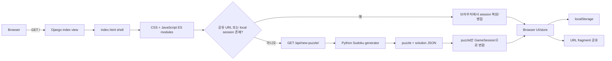

# Sudoku Django 현행 구현 분석

- 작성일: 2026-08-02
- 분석 대상: `C:\Users\mhj21\Desktop\workspace\sudoku_django`
- 목적: Cloudflare Pages + Workers 구조 개편에 앞서 현재 구현의 책임, 실행 흐름, 인터페이스 및 전환 제약을 사실 기반으로 정리한다.
- 범위: 현행 코드와 테스트 분석만 포함한다. Cloudflare 제품별 런타임 지원, 요금, 제한 및 최종 전환 설계는 이 문서에서 확정하지 않는다.

## 1. 요약

현재 프로젝트는 Django 전체 기능을 폭넓게 사용하는 애플리케이션이 아니라 다음 두 서버 기능 위에 큰 브라우저 애플리케이션을 올린 구조다.

1. `GET /`에서 Django template로 최소 HTML shell을 반환한다.
2. `GET /api/new-puzzle/`에서 Python으로 9×9 Sudoku 문제를 생성하고 JSON을 반환한다.

게임 진행, 충돌 및 완료 판정, 후보 숫자, 실행 취소/다시 실행, 메모, 설정, 로컬 저장, 공유 링크 생성과 복원은 모두 vanilla JavaScript ES module이 브라우저에서 처리한다. 애플리케이션 고유 model이나 서버-side 사용자 데이터 저장은 없다.

따라서 현재 코드 기준의 전환 경계는 명확하다.

- Cloudflare Pages 후보: HTML 1개, CSS 4개, JavaScript ES module 전체
- Cloudflare Worker 후보: 현재 `GET /api/new-puzzle/`가 수행하는 문제 생성
- 초기 전환에 불필요한 항목: 애플리케이션 database, 서버 session, 사용자 인증, 서버-side 진행 상태 저장

정적 부분은 Django template tag를 일반 asset path로 바꾸면 독립할 수 있다. 가장 큰 기술 검증 대상은 Python DLX 생성기를 Worker 환경에서 어떤 방식으로 실행할지와 생성 요청의 CPU/시간 한도를 만족할지이다.

## 2. 현재 구성

### 2.1 Repository 구조

| 영역 | 주요 경로 | 책임 |
|---|---|---|
| Django project | `sudoku_django/` | settings, root URL, ASGI/WSGI entry point |
| Django app | `game/` | HTML view, JSON API, Sudoku Python engine |
| HTML | `game/templates/game/index.html` | `#app` mount point와 CSS/ESM entry 연결 |
| Browser app | `game/static/game/js/` | 상태, 규칙, UI, 저장, 공유, bootstrap |
| Styles | `game/static/game/css/` | token, layout, board, chrome styles |
| Python tests | `game/tests/` | engine, legacy interface, HTTP view contract |
| JavaScript tests | `tests/js/` | Node 내장 test runner 기반 unit/integration tests |
| Manual/browser tools | `tools/` | contrast, smoke, browser audit scripts |
| Historical documents | `docs/` | 기존 설계, 단계 문서 및 acceptance report |

확인된 runtime dependency는 `Django==6.0.7`, `asgiref`, `sqlparse`, `tzdata`다. `package.json`과 npm dependency는 없다. JavaScript는 browser-native API와 ES module을 사용하며 Node 테스트도 외부 test framework 없이 실행된다.

Cloudflare 관련 `wrangler.toml`, `wrangler.json`, `wrangler.jsonc`는 현재 존재하지 않는다.

### 2.2 Django 설정 상태

`sudoku_django/settings.py`는 `django-admin startproject` 기본 개발 설정에 가깝다.

- `DEBUG = True`
- `ALLOWED_HOSTS = []`
- source에 `django-insecure-` prefix의 `SECRET_KEY`가 포함됨
- SQLite 설정과 로컬 `db.sqlite3` 파일이 존재함
- Django admin/auth/contenttypes/sessions/messages/staticfiles가 설치됨
- standard security/session/CSRF/auth/message middleware가 설정됨
- `STATIC_URL = 'static/'`
- ASGI와 WSGI entry point가 모두 존재함
- Gunicorn, Uvicorn, WhiteNoise 등의 별도 production serving dependency/configuration은 없음

`game/models.py`와 `game/admin.py`에는 실제 model 또는 admin 등록이 없다. root URL에는 `/admin/`이 남아 있지만, 확인한 게임 기능의 `/` 및 `/api/new-puzzle/` 흐름은 database model, 인증, server session을 사용하지 않는다.

Django `check --deploy`는 exit code 0으로 끝났지만 다음 7개 production security warning을 보고했다.

- HSTS 미설정
- HTTPS redirect 미설정
- 개발용 `SECRET_KEY`
- secure session cookie 미설정
- secure CSRF cookie 미설정
- `DEBUG = True`
- 비어 있는 `ALLOWED_HOSTS`

이는 현재 Django 설정이 production 배포용으로 완성된 상태가 아니라는 근거다. Cloudflare 구조로 전환하면 이 Django production 설정을 보강하는 대신 Django runtime 자체를 제거하는 방향을 검토할 수 있다.

## 3. HTTP 인터페이스와 요청 흐름

### 3.1 Route 목록

| Method | Path | 구현 | 응답/역할 |
|---|---|---|---|
| GET | `/` | `game.views.index` | `game/index.html` render |
| GET | `/api/new-puzzle/` | `game.views.new_puzzle` | `{ "puzzle": [...], "solution": [...] }` JSON |
| Django admin | `/admin/` | Django 기본 admin | 게임 기능에서는 사용 근거 없음 |

`new_puzzle` view 자체에는 HTTP method 제한 decorator, 입력 parameter, 인증, rate limit 또는 cache 처리가 없다. 현재 테스트와 browser client는 GET만 사용한다.

### 3.2 전체 실행 흐름



HTML 응답에는 puzzle이나 solution data가 삽입되지 않는다. 브라우저가 `main.js`를 module로 load하고 `app.js`를 dynamic import한 뒤 다음 순서로 bootstrap한다.

1. 빈 화면 방지를 위한 skeleton을 즉시 표시한다.
2. `#s=...` URL fragment가 있으면 browser에서 decode한다.
3. `localStorage`의 기존 session을 복원한다.
4. 공유 상태와 local 상태가 동시에 있으면 puzzle/core/notes conflict rule에 따라 채택 또는 병합한다.
5. 채택할 상태가 전혀 없을 때만 `/api/new-puzzle/`를 호출한다.
6. store와 UI adapter를 mount한다.
7. 변경 상태를 debounce하여 `localStorage`에 저장한다.

재방문자에게 복원 가능한 local session이 있으면 network에서 새 puzzle을 요청하지 않는 것이 명시적 동작이다.

### 3.3 새 puzzle API 계약

현재 interface는 다음과 같이 고정되어 있다.

```json
{
  "puzzle": [81개의 0..9 정수],
  "solution": [81개의 1..9 정수]
}
```

- 기본 puzzle은 9×9이고 target givens는 32개다.
- Python test는 response key가 정확히 `puzzle`, `solution` 두 개인지 검사한다.
- browser는 `puzzle`이 길이 81의 `0..9` 정수 배열인지 확인한다.
- browser는 받은 `solution`을 GameSession에 저장하지 않고 폐기한다.
- client의 완료 판정은 solution 비교가 아니라 row/column/box constraint로 수행한다.
- client timeout은 10초다.
- network error 또는 5xx는 1초 뒤 한 번 재시도한다.
- 4xx는 재시도하지 않으며 offline이면 network 호출을 생략한다.

Worker 전환에서 frontend 변경을 최소화하려면 same-origin의 `/api/new-puzzle/` path와 현재 JSON shape를 우선 보존해야 한다. `solution` 제거는 traffic을 줄일 수 있지만 현재 test가 interface를 고정하고 있으므로 별도 승인과 contract 변경 작업이 필요하다.

## 4. Python Sudoku engine

### 4.1 Module 계층

| Module | 책임 |
|---|---|
| `game/generator.py` | 기존 view/import interface를 유지하는 compatibility facade |
| `game/sudoku/spec.py` | dimension, box geometry, constraint index, board validation |
| `game/sudoku/dlx.py` | iterative Dancing Links / Algorithm X engine |
| `game/sudoku/solver.py` | solve, solution count, uniqueness classification, matrix cache |
| `game/sudoku/generator.py` | solved grid 생성, clue 제거, difficulty 및 time limit |

`game.views`는 compatibility facade의 parameter 없는 `generate_puzzle()`을 호출한다. 이 public call의 기본값은 `dim=9`, `target_givens=32`다.

### 4.2 생성 방식

1. dimension에 맞는 exact-cover matrix를 준비한다.
2. candidate 순서를 randomize한 DLX search로 완성 grid를 하나 만든다.
3. cell 순서를 shuffle한다.
4. clue를 하나씩 제거한다.
5. 제거한 cell과 다른 값을 갖는 대체 solution 존재 여부를 DLX로 확인한다.
6. uniqueness가 입증될 때만 제거를 유지한다.

Search budget 초과는 “unique”로 간주되지 않는다. 이 경우 clue를 원복하므로 어려움 목표보다 clue가 더 많은 puzzle을 만들 수는 있어도 uniqueness를 추측으로 통과시키지는 않는다.

### 4.3 지원 범위와 실행 특성

- engine geometry는 9×9, 12×12, 16×16 preset을 포함한다.
- 현재 HTTP API와 browser client는 9×9만 사용한다.
- client는 `dim=12` session을 명시적으로 거부한다.
- DLX는 object graph 대신 flat integer list를 사용한다.
- recursive search 대신 explicit stack을 사용하는 iterative search다.
- matrix는 search 중 mutable하므로 thread-safe하지 않다.
- Python server에서는 `threading.local()`에 dimension별 matrix를 cache한다.
- search iteration budget은 9×9 200,000, 12×12 1,000,000, 16×16 5,000,000이다.
- clue 제거 wall-clock limit은 각각 5초, 15초, 45초다.

Worker 전환에서는 `threading.local()` cache 수명과 Python process/thread model을 그대로 전제할 수 없다. runtime 선택 후 request isolation, warm instance reuse, global cache 안전성 및 CPU limit을 별도로 측정해야 한다.

## 5. Browser 애플리케이션

### 5.1 기술 구성

- framework 없는 vanilla JavaScript
- browser-native ES modules
- DOM API로 직접 render
- 별도 bundler/transpiler 없음
- 4개 CSS 파일을 HTML에서 직접 load
- 동적 `import("./app.js")`로 실제 application composition 시작

`index.html`에서 Django에 종속된 부분은 ``와 5개의 `` 사용이다. HTML body는 `<main id="app"></main>`뿐이므로 일반 정적 HTML로 전환할 때 server-side rendering logic을 재구현할 필요는 없다.

### 5.2 주요 module 책임

| 영역 | 주요 module | 책임 |
|---|---|---|
| Entry/composition | `main.js`, `app.js`, `bootstrap.js` | skeleton, dependency wiring, restore-before-network, UI mount |
| Domain state | `core/store.js`, `core/history.js` | mutation, subscription, undo/redo, note, candidates |
| Rule | `core/spec.js`, `core/rules.js` | 9×9 geometry, conflict, completion, candidate elimination |
| Persistence | `state/persistence.js`, `state/serialize.js` | debounce save, schema validation, restore, migration ladder |
| Settings | `state/settings.js` | conflict display, candidate cleanup, keyboard/touch preferences |
| Sharing | `url/*`, `ui/share-view.js` | compact URL encoding/decoding, CRC, optional compression, clipboard/share |
| UI | `ui/*` | board, keyboard, touch, dialogs, notes, accessibility announcements |

### 5.3 Client state

GameSession의 persistent field는 다음과 같다.

| Field | 의미 |
|---|---|
| `schemaVersion` | 현재 1 |
| `puzzleId` | browser에서 `Date.now()` 기반으로 생성 |
| `dim` | 현재 9만 허용 |
| `givens` | server에서 받은 puzzle clue |
| `values` | 사용자 입력 값 |
| `candidates` | cell별 candidate bit mask |
| `cellNotes` | cell note map |
| `regionNotes` | row/column/box note map |
| `createdAt`, `updatedAt` | browser timestamp |

Session key는 `sudoku:v1:session`, settings key는 `sudoku:v1:settings`다. 저장 실패나 privacy mode에서 `localStorage`가 예외를 던지면 memory-only fallback으로 동작한다. 서버에는 진행 상태가 저장되지 않는다.

History와 transient UI state는 serialized session에 포함되지 않는다. session decoder는 길이, 값 범위, note key/size, schema version 및 given/value overlap을 검증하고 잘못된 local data를 fail-closed 방식으로 거부한다.

### 5.4 공유

공유 데이터는 server database가 아니라 현재 page URL의 `#s=<encoded-state>` fragment에 들어간다. URL fragment는 HTTP request에 포함되지 않으므로 정적 hosting으로 옮겨도 공유 decode는 계속 browser 책임이다.

- SC1: puzzle givens만 공유
- SC2: 사용자 입력과 candidates 포함
- SC3: notes까지 포함하며 privacy warning 표시
- CRC32로 payload 손상 검사
- `CompressionStream` 사용 가능 시 compression 지원
- 2,000자 초과 warning, notes가 원인인 SC3 8,000자 초과는 거부

## 6. 데이터 및 외부 의존성

### 6.1 Server-side persistence

애플리케이션 고유 server-side persistence는 확인되지 않았다.

- model 없음
- app migration 없음
- 사용자 계정 연동 없음
- puzzle cache/table 없음
- score/ranking/history API 없음
- session을 읽거나 쓰는 game code 없음

따라서 현행 기능만 유지하는 1차 Cloudflare 전환에는 D1, KV, R2 같은 persistent service가 필수라는 근거가 없다. 향후 puzzle pre-generation/cache, abuse control, 통계, 계정 동기화를 도입하면 별도 설계가 필요하다.

### 6.2 Network 및 browser capability

애플리케이션 실행 중 확인된 자체 network dependency는 `/api/new-puzzle/`뿐이다. 나머지는 `localStorage`, Clipboard API, Web Share API, `CompressionStream`, pointer/media query, History API 같은 browser capability다.

## 7. 테스트와 검증 상태

### 7.1 실행 결과

| 검증 | 상태 | 결과 |
|---|---|---|
| `venv\Scripts\python.exe manage.py test` | PASS | 88 tests, 0 failures, 약 2.334초 |
| `node --test "tests/js/*.test.mjs"` | PASS | 239 tests, 0 failures, 약 1.212초 |
| `venv\Scripts\python.exe manage.py check --deploy` | PASS | exit code 0, production security warning 7개 |
| 실제 browser smoke/audit | NOT RUN | 이번 분석에서는 실행하지 않음 |
| 실제 Cloudflare Pages/Worker 배포 | NOT RUN | 설정과 배포 artifact가 아직 없음 |
| Worker runtime에서 puzzle 생성 benchmark | NOT RUN | runtime/구현 방식 미결정 |

Python tests는 DLX 구조/복구, solver correctness, uniqueness, generation, 9/12/16 geometry, legacy facade 및 HTTP contract를 포함한다. JavaScript tests는 state/store, serialization, URL codec, bootstrap, persistence, keyboard/touch/UI composition 및 일부 CSS/DOM contract를 포함한다.

### 7.2 분석 중 명령 기록

분석 명령은 다음 상태로 실행되었다.

| 순서 | 목적 | 상태 | 비고 |
|---:|---|---|---|
| 1 | `git status --short` 및 `rg --files` inventory | PASS | 사용자 수정 파일 2개와 전체 파일 목록 확인 |
| 2 | backend/settings/template source 일괄 읽기 | PASS | 출력 일부가 도구 표시 한도로 축약되어 후속 명령으로 보완 |
| 3 | JS/Python symbol 및 test contract 복합 검색 | FAIL | Windows에서 `rg game/*.py` glob이 `os error 123` 발생; source failure 아님 |
| 4 | 유효한 `rg -g '*.py'`와 `bootstrap.js`/`app.js` 재확인 | PASS | Python symbol 및 composition 흐름 확인 |
| 5 | client state/rule/test/repository metadata 읽기 | PASS | tracked file 및 local `db.sqlite3` 존재 확인 |
| 6 | Django tests, Node tests, Django deploy check | PASS | 88 + 239 tests 통과, deploy warning 7개 |
| 7 | source anchor/config 부재 복합 검색 | FAIL | frontend 정규식 quoting 오류; source failure 아님 |
| 8 | frontend fixed-string anchor 재검색 | PASS | template, API path, storage, bootstrap anchor 확인 |

두 FAIL은 프로젝트 command/test failure가 아니라 분석용 검색 명령의 Windows path/quoting 오류다. 모두 수정된 명령으로 재확인했다.

## 8. Cloudflare 전환 관점의 경계와 위험

### 8.1 낮은 변경량으로 분리 가능한 부분

1. `index.html`의 Django static template tag를 일반 path로 변경한다.
2. `game/static/game/css`와 `game/static/game/js`를 Pages publish directory에 배치한다.
3. same-origin `/api/new-puzzle/`를 Worker route 또는 Pages Function으로 연결한다.
4. 기존 JSON contract를 유지하면 client fetch code를 그대로 둘 수 있다.
5. 공유 link는 fragment 기반이므로 server-side routing이나 저장소가 필요하지 않다.

### 8.2 반드시 검증해야 하는 부분

| 항목 | 현행 사실 | 전환 위험/검증 사항 |
|---|---|---|
| Generator runtime | CPython module, `threading.local()` 사용 | Worker에서 Python을 유지할지 JS/TypeScript/WASM으로 이식할지 결정 필요 |
| CPU/시간 | clue 제거 limit 최대 5초(현재 9×9), client timeout 10초 | 선택 plan/runtime의 CPU 및 wall-clock limit 안에서 실제 benchmark 필요 |
| Mutable cache | thread별 mutable DLX matrix 재사용 | isolate/request 사이 재사용과 동시성 안전성 재설계 필요 |
| API abuse | 인증/rate limit/cache 없음 | 공개 Worker 비용과 부하를 제어할 정책 필요 |
| API response | 사용하지 않는 `solution`도 전송 | contract 보존과 payload 축소 중 선택 필요 |
| Same-origin | frontend가 absolute `/api/new-puzzle/` 사용 | 별도 Worker domain이면 CORS 및 URL 설정 변경 필요 |
| Static paths | Django template tag로 생성 | Pages directory 기준 path와 MIME type 확인 필요 |
| Production config | Cloudflare config 없음 | build/publish/route/environment 설정 신규 작성 필요 |

### 8.3 현재 시점의 판단

- 정적 UI는 build dependency가 없고 server-rendered data도 없어서 Pages로 분리하기 유리하다.
- database migration은 핵심 과제가 아니다.
- 실질적인 migration 난이도는 puzzle generator 실행 방식에 집중된다.
- 초기 호환성 목표는 `GET /`, same-origin `GET /api/new-puzzle/`, JSON response shape, localStorage key 및 URL fragment format 보존이 적합하다.
- Worker storage 추가, API contract 축소, multi-dimension UI 지원은 현행 이전과 분리해야 scope가 커지지 않는다.

## 9. 기존 작업 트리 보호

분석 시작 시 다음 사용자 변경이 이미 존재했다.

- `game/static/game/js/core/store.js`
- `game/static/game/js/ui/app-shell.js`

이번 작업에서는 두 파일을 포함한 application source를 수정하지 않았다. 새로 추가한 artifact는 이 분석 문서 하나다.

## 10. 다음 단계 제안

구현 전환을 계속하려면 `$staged-development`의 1단계인 System Design에서 다음 의사결정을 먼저 확정하는 것이 적절하다.

1. Worker generator 구현 방식: Python 유지, JavaScript/TypeScript port, WASM, 또는 pre-generated pool
2. Pages/Worker routing: same-origin route 구성
3. API contract: `solution` 보존 여부
4. puzzle generation 성능 목표와 rate limit/cache 정책
5. static publish directory와 source layout
6. 기존 Django/Node test를 새 구조에서 어떻게 유지할지

이 문서는 현행 파악 단계의 결과이며, 위 설계나 구현을 승인한 것으로 간주하지 않는다.
